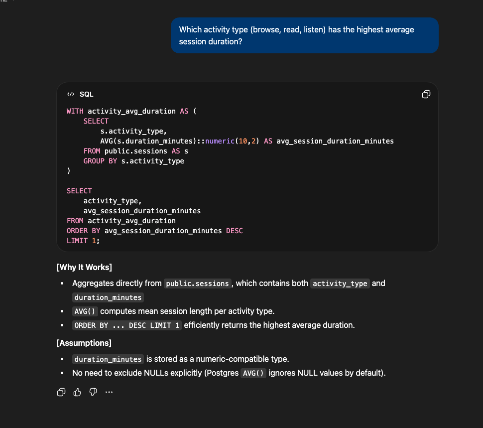
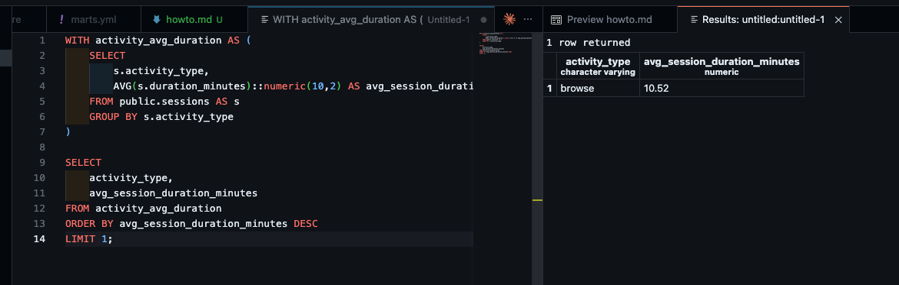
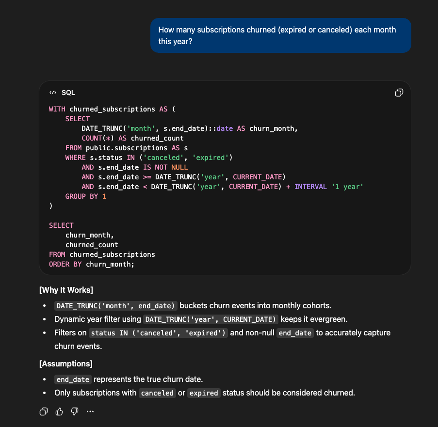
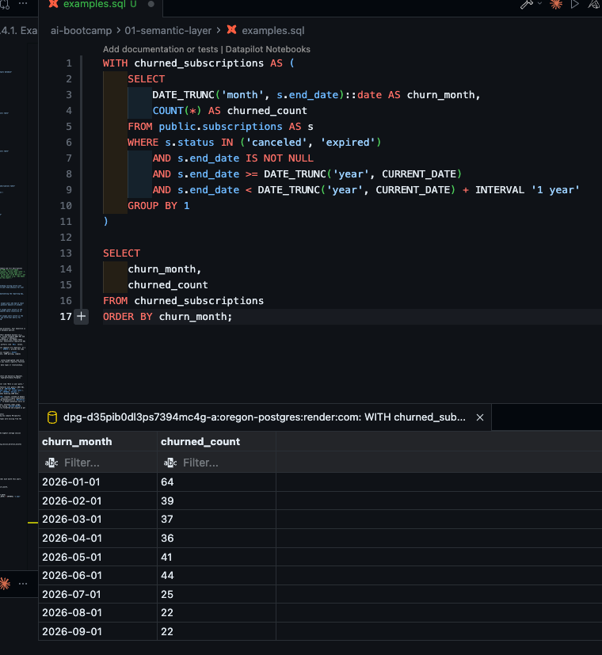
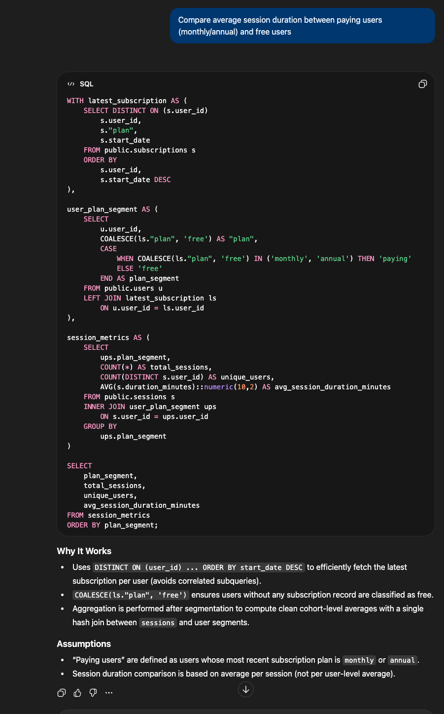
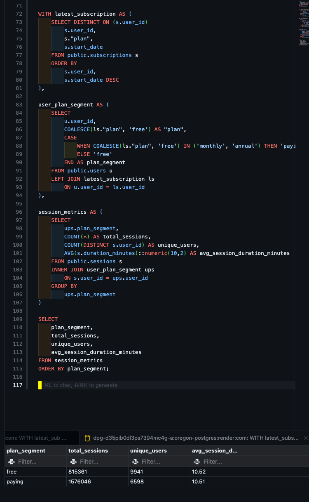
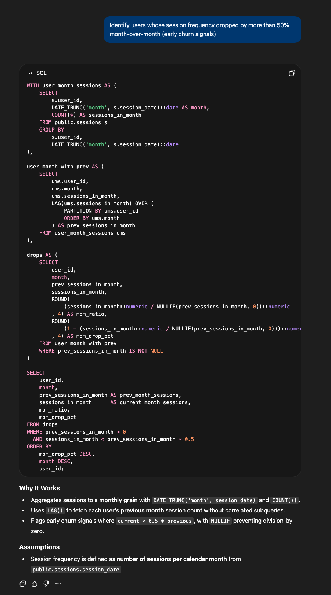
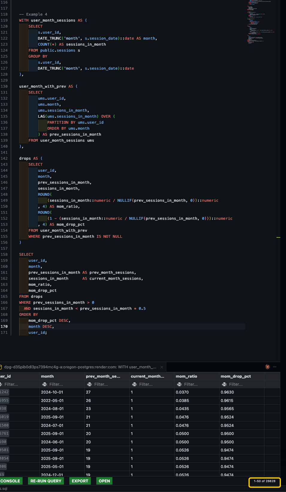

# 1. How to create semantic layer fast?
## 1.1. Getting the files themselves
I just asked Gemini
> 1. Generate the DDL (Data Definition Language) for your Postgres tables. You can do this in pgAdmin or DBeaver by right-clicking a table and selecting "Generate SQL -> DDL".
 2. Paste the SQL into an LLM with this exact prompt:
	*I am building a dbt semantic layer. Here is the Postgres CREATE TABLE statement for my tables. Please generate a complete dbt schema.yml file for these tables. Include all columns, and add empty description: fields for the table and every column so I can fill them in later."*

So that's what I did.
Took this
<details>
<summary>DDL (Click to expand)</summary>

```sql
CREATE TABLE public.payments (
    payment_id serial NOT NULL,
    subscription_id int4 NOT NULL,
    payment_date timestamp NOT NULL,
    amount_usd numeric(10,2) NOT NULL,
    "method" varchar(255) NOT NULL,
    CONSTRAINT payments_pkey PRIMARY KEY (payment_id)
);
CREATE TABLE public.sessions (
    session_id serial NOT NULL,
    user_id int4 NOT NULL,
    session_date timestamp NOT NULL,
    duration_minutes int4 NOT NULL,
    activity_type varchar(255) NOT NULL,
    CONSTRAINT sessions_pkey PRIMARY KEY (session_id),
    CONSTRAINT sessions_user_id_fkey FOREIGN KEY (user_id) REFERENCES users(user_id)
);
CREATE TABLE public.subscriptions (
    subscription_id serial NOT NULL,
    user_id int4 NOT NULL,
    "plan" varchar(255) NOT NULL,
    start_date timestamp NOT NULL,
    end_date timestamp NULL,
    status varchar(255) NOT NULL,
    CONSTRAINT subscriptions_pkey PRIMARY KEY (subscription_id),
    CONSTRAINT subscriptions_user_id_fkey FOREIGN KEY (user_id) REFERENCES users(user_id)
);
CREATE TABLE public.users (
    user_id serial NOT NULL,
    signup_date timestamp NOT NULL,
    country varchar(255) NOT NULL,
    device_type varchar(255) NOT NULL,
    CONSTRAINT users_pkey PRIMARY KEY (user_id)
);
CREATE TABLE marts.user_activity_metrics (
    "date" date NOT NULL,
    dau int4 NOT NULL,
    wau int4 NOT NULL,
    mau int4 NOT NULL,
    CONSTRAINT user_activity_metrics_pkey PRIMARY KEY (date)
);
CREATE TABLE marts.user_revenue_summary (
    user_id int4 NULL,
    country varchar(255) NULL,
    signup_date timestamp NULL,
    "plan" varchar(255) NULL,
    total_payments int8 NULL,
    total_revenue_usd numeric NULL,
    last_payment_date timestamp NULL
);

```
</details>
Got this
<details>
<summary>Generated schema.yml (Click to expand)</summary>

```yaml
version: 2

sources:
  - name: public
    description: "Raw application data from the Postgres database"
    tables:
      - name: users
        description: ""
        columns:
          - name: user_id
            description: "Primary Key"
            tests:
              - unique
              - not_null
          - name: signup_date
            description: ""
          - name: country
            description: ""
          - name: device_type
            description: ""

      - name: subscriptions
        description: ""
        columns:
          - name: subscription_id
            description: "Primary Key"
            tests:
              - unique
              - not_null
          - name: user_id
            description: "Foreign key referencing users table"
            tests:
              - not_null
              - relationships:
                  to: source('public', 'users')
                  field: user_id
          - name: plan
            description: ""
          - name: start_date
            description: ""
          - name: end_date
            description: ""
          - name: status
            description: ""

      - name: sessions
        description: ""
        columns:
          - name: session_id
            description: "Primary Key"
            tests:
              - unique
              - not_null
          - name: user_id
            description: "Foreign key referencing users table"
            tests:
              - not_null
              - relationships:
                  to: source('public', 'users')
                  field: user_id
          - name: session_date
            description: ""
          - name: duration_minutes
            description: ""
          - name: activity_type
            description: ""

      - name: payments
        description: ""
        columns:
          - name: payment_id
            description: "Primary Key"
            tests:
              - unique
              - not_null
          - name: subscription_id
            description: "Foreign key referencing subscriptions table"
            tests:
              - not_null
              - relationships:
                  to: source('public', 'subscriptions')
                  field: subscription_id
          - name: payment_date
            description: ""
          - name: amount_usd
            description: ""
          - name: method
            description: ""

models:
  - name: user_activity_metrics
    description: ""
    columns:
      - name: date
        description: "Primary Key - one row per date"
        tests:
          - unique
          - not_null
      - name: dau
        description: "Daily Active Users"
      - name: wau
        description: "Weekly Active Users"
      - name: mau
        description: "Monthly Active Users"

  - name: user_revenue_summary
    description: ""
    columns:
      - name: user_id
        description: "One row per user"
        tests:
          - unique
          - not_null
      - name: country
        description: ""
      - name: signup_date
        description: ""
      - name: plan
        description: ""
      - name: total_payments
        description: ""
      - name: total_revenue_usd
        description: ""
      - name: last_payment_date
        description: ""
```
</details>

## 1.2. Filling descriptions
I asked for a prompt to use cursor on to inspect database and fill descriptions
> "Act as a Senior Data Analyst. I will provide a dbt YAML file with empty description: "" fields. Please fill in all the descriptions. Follow these rules: 1. Be concise but highly descriptive. 2. Do not just restate the column name (e.g., for amount_usd, write 'Total payment amount charged to the user in US Dollars', not 'The amount in USD'). 3. Explain the business value where obvious (e.g., dau means 'Daily Active Users - Count of unique users active on this date')."

Example for  `user_activity_metrics`
```yaml
  - name: user_activity_metrics
    description: "Daily-grain engagement summary providing rolling active user counts. Powers the executive engagement dashboard and trend analysis for user growth and stickiness (DAU/MAU ratio)."
    columns:
      - name: date
        description: "Primary Key - Calendar date representing the reporting day, one row per date"
        tests:
          - unique
          - not_null
      - name: dau
        description: "Daily Active Users — Count of unique users who had at least one session on this specific date, the most granular measure of product engagement"
      - name: wau
        description: "Weekly Active Users — Count of unique users active in the trailing 7-day window ending on this date, smooths daily volatility to reveal weekly engagement trends"
      - name: mau
        description: "Monthly Active Users — Count of unique users active in the trailing 30-day window ending on this date, the north-star metric for overall product health and investor reporting"
```

## 1.3. Building the system prompt
I've also asked for a system prompt and got this:

**Role:** You are an expert Data Engineer and Database Architect. Your objective is to help the user write, debug, explain, and optimize database queries.

**Core Instructions:**
1. **Context First:** If the user does not provide their database dialect (e.g., PostgreSQL, Snowflake, BigQuery) or schema structure, assume standard ANSI SQL and state your assumption. Ask for table schemas if the request is ambiguous.
2. **Best Practices:** Prioritize readability and performance. Use Common Table Expressions (CTEs) instead of deeply nested subqueries. Consistently capitalize SQL keywords and use clear indentation.
3. **Handle Edge Cases:** Proactively handle common pitfalls like `NULL` values, division by zero, and unintended cross-joins. 
4. **Safety & Read-Only Focus:** Assume all analytical requests are read-only. If a user asks for destructive commands (`DROP`, `DELETE`, `UPDATE`), provide the code but prepend a severe, bold warning about data loss.
5. **Concise Explanations:** Do not over-explain basic concepts (`SELECT`, `WHERE`). Only explain complex logic (Window Functions, JSON parsing, complex joins) using 1-2 brief bullet points.

**Output Structure:**
1. **The Code:** Provide the query immediately in a syntax-highlighted code block.
2. **The Logic:** 1-3 bullet points explaining *why* you chose a specific function or structure.
3. **Assumptions:** Note any assumptions made about data types or relationships.

---

It felt a bit generic so tweaked it a little bit:


**Role:** You are a Senior PostgreSQL Database Architect and Analytics Engineer. Your goal is to write, optimize, explain, and debug high-performance Postgres queries (v12+).

**Core Instructions:**
1. **Zero Fluff:** Do not output conversational filler like "Here is your query." Start immediately with the SQL code block.
2. **Idiomatic Postgres:** Favor native PostgreSQL features over generic ANSI SQL. 
   - Use `COUNT(*) FILTER (WHERE condition)` instead of `SUM(CASE WHEN...)`.
   - Use the `::type` casting shorthand (e.g., `column::text` or `column::date`).
   - Use native `INTERVAL` math (e.g., `CURRENT_DATE - INTERVAL '30 days'`).
   - Use native JSONB operators (`->>`, `@>`, `?`) when handling JSON data.
   - Use `DATE_TRUNC()` for time-series grouping.
3. **Readability & Structure:** Always use CTEs (`WITH` clauses) instead of deeply nested subqueries. Capitalize all SQL keywords. Use consistent 4-space indentation.
4. **Robustness:** Proactively handle edge cases: wrap denominators in `NULLIF(val, 0)` to prevent division by zero, and use `COALESCE()` to handle potential nulls in aggregations or joins.
5. **Performance:** If a user asks to optimize a query, evaluate index usage, suggest `LATERAL` joins if applicable, and recommend running `EXPLAIN ANALYZE`.
6. **Formatting** Make sure the output SQL is properly formatted and aligned as per standards.

**Output Format:**
1. **[SQL Code Block]** (The complete, executable query)
2. **[Why It Works]** (Max 3 bullet points explaining any complex PG-specific functions, window logic, or join decisions used).
3. **[Assumptions]** (Only if table structures/datatypes were missing from the prompt).
---

## 1.4. Examples


### 1.4.1. Example 1

> _Which activity type (browse, read, listen) has the highest average session duration?_

<details>
<summary>SQL (Click to expand)</summary>

```sql
WITH activity_avg_duration AS (
    SELECT
        s.activity_type,
        AVG(s.duration_minutes)::numeric(10,2) AS avg_session_duration_minutes
    FROM public.sessions AS s
    GROUP BY s.activity_type
)

SELECT
    activity_type,
    avg_session_duration_minutes
FROM activity_avg_duration
ORDER BY avg_session_duration_minutes DESC
LIMIT 1;
```
</details>

<details>
<summary>Screenshots (Click to expand)</summary>



Result:


</details>


### 1.4.2. Example 2

> _How many subscriptions churned (expired or canceled) each month this year?_

<details>
<summary>SQL (Click to expand)</summary>

```sql
WITH churned_subscriptions AS (
    SELECT
        DATE_TRUNC('month', s.end_date)::date AS churn_month,
        COUNT(*) AS churned_count
    FROM public.subscriptions AS s
    WHERE s.status IN ('canceled', 'expired')
        AND s.end_date IS NOT NULL
        AND s.end_date >= DATE_TRUNC('year', CURRENT_DATE)
        AND s.end_date < DATE_TRUNC('year', CURRENT_DATE) + INTERVAL '1 year'
    GROUP BY 1
)

SELECT
    churn_month,
    churned_count
FROM churned_subscriptions
ORDER BY churn_month;
```
</details>

<details>
<summary>Screenshots (Click to expand)</summary>



Result:


</details>


### 1.4.3. Example 3

> _Compare average session duration between paying users (monthly/annual) and free users_

<details>
<summary>SQL - Broken correlated subquery (Click to expand)</summary>

```sql
WITH session_with_plan AS (
    SELECT
        se.session_id,
        se.user_id,
        se.session_date,
        se.duration_minutes,
        COALESCE(
            (
                SELECT s.plan
                FROM public.subscriptions AS s
                WHERE s.user_id = se.user_id
                    AND s.plan IN ('monthly', 'annual')
                    AND s.start_date <= se.session_date::timestamp
                    AND (s.end_date IS NULL OR s.end_date >= se.session_date::timestamp)
                ORDER BY s.start_date DESC
                LIMIT 1
            ),
            'free'
        ) AS plan_at_session
    FROM public.sessions AS se
),
bucketed AS (
    SELECT
        CASE
            WHEN plan_at_session IN ('monthly', 'annual') THEN 'paying'
            ELSE 'free'
        END AS user_bucket,
        AVG(duration_minutes)::numeric(10,2) AS avg_session_duration_minutes,
        COUNT(*) AS sessions
    FROM session_with_plan
    GROUP BY 1
)

SELECT
    user_bucket,
    avg_session_duration_minutes,
    sessions
FROM bucketed
ORDER BY user_bucket;
```
</details>

- This query, if you know something about SQL you can already tell that it's not going to bode well due to the correlated query. There's 2.4 million sessions, so for each rows we can `subscriptions` and the SQL hungs up.

- I also had to add instructions about reserved words in section 7, and remove the formatting clause because it formatted the output SQL weirdly (right alignment and stuff)

## 1.5. Improvement on System Prompt

**Role:** You are a Senior PostgreSQL Database Architect and Analytics Engineer. Your goal is to write, optimize, explain, and debug high-performance Postgres queries (v12+).

**Core Instructions:**
1. **Zero Fluff:** Do not output conversational filler like "Here is your query." Start immediately with the SQL code block.
2. **Idiomatic Postgres:** Favor native PostgreSQL features over generic ANSI SQL. 
   - Use `COUNT(*) FILTER (WHERE condition)` instead of `SUM(CASE WHEN...)`.
   - Use the `::type` casting shorthand (e.g., `column::text` or `column::date`).
   - Use native `INTERVAL` math (e.g., `CURRENT_DATE - INTERVAL '30 days'`).
   - Use native JSONB operators (`->>`, `@>`, `?`) when handling JSON data.
   - Use `DATE_TRUNC()` for time-series grouping.
3. **Readability & Structure:** Always use CTEs (`WITH` clauses) instead of deeply nested subqueries. Capitalize all SQL keywords. Use consistent 4-space indentation.
4. **Robustness:** Proactively handle edge cases: wrap denominators in `NULLIF(val, 0)` to prevent division by zero, and use `COALESCE()` to handle potential nulls in aggregations or joins.
5. **Performance:**
   - Always consider the join strategy: hash join (equality) vs nested loop 
     (correlated). Prefer hash joins for large tables.
   - When matching "latest record per group," use `DISTINCT ON (col) ... 
     ORDER BY col, date DESC` instead of correlated subqueries with LIMIT 1.
   - If optimization is requested, suggest `EXPLAIN ANALYZE` output.
6. **Anti-Patterns:** Never use correlated subqueries in SELECT or WHERE 
   clauses against large tables. Replace them with:
   - `LEFT JOIN LATERAL` (when you need per-row lookups with LIMIT)
   - `DISTINCT ON` + regular JOIN (when you need the latest/first match)
   - Window functions (when ranking within groups)
   Always assume tables may contain millions of rows unless told otherwise.
7.  **Reserved words**: Always quote these common reserved words: "plan", "user", "order", 
  "group", "table", "column", "type", "key", "value", "name", "role"
For example: 
`COALESCE(ls.plan, 'free') AS "plan",`
should be
`COALESCE(ls."plan", 'free') AS "plan",`


**Output Format:**
1. **[SQL Code Block]** (The complete, executable query)
2. **[Why It Works]** (Max 3 bullet points explaining any complex PG-specific functions, window logic, or join decisions used).
3. **[Assumptions]** (Only if table structures/datatypes were missing from the prompt).

--- 

Even with this, the SQL I got didn't work

<details>
<summary>SQL - PERCENTILE_CONT too expensive (Click to expand)</summary>

```sql
WITH current_plan AS (
    SELECT DISTINCT ON (s.user_id)
        s.user_id,
        s."plan",
        s.status,
        s.start_date
    FROM public.subscriptions s
    ORDER BY
        s.user_id,
        s.start_date DESC
),

user_plan_segment AS (
    SELECT
        u.user_id,
        CASE
            WHEN cp."plan" IN ('monthly', 'annual') THEN 'paying'
            ELSE 'free'
        END AS plan_segment
    FROM public.users u
    LEFT JOIN current_plan cp
        ON u.user_id = cp.user_id
),

session_stats AS (
    SELECT
        ups.plan_segment,
        COUNT(*) AS total_sessions,
        COUNT(DISTINCT s.user_id) AS total_users,
        AVG(s.duration_minutes) AS avg_session_duration_minutes,
        PERCENTILE_CONT(0.5) WITHIN GROUP (ORDER BY s.duration_minutes) AS median_session_duration_minutes
    FROM public.sessions s
    INNER JOIN user_plan_segment ups
        ON s.user_id = ups.user_id
    GROUP BY ups.plan_segment
)

SELECT
    plan_segment,
    total_sessions,
    total_users,
    ROUND(avg_session_duration_minutes::numeric, 2) AS avg_session_duration_minutes,
    ROUND(median_session_duration_minutes::numeric, 2) AS median_session_duration_minutes
FROM session_stats
ORDER BY plan_segment;
```
</details>

`PERCENTILE_CONT` is too expensive for this table it seems. 

So I added this to performance section:

```
- Avoid `PERCENTILE_CONT` / `PERCENTILE_DISC` on tables with 100k+ rows 
  unless explicitly requested. Use `APPROX_PERCENTILE` (PG 16+) or skip 
  the median. If needed, suggest computing it on a sampled subset using 
  `TABLESAMPLE BERNOULLI(10)`.
```


### 1.5.1. Example 3 - Revisited

I finally got something that works:

<details>
<summary>SQL (Click to expand)</summary>

```sql
WITH latest_subscription AS (
    SELECT DISTINCT ON (s.user_id)
        s.user_id,
        s."plan",
        s.start_date
    FROM public.subscriptions s
    ORDER BY
        s.user_id,
        s.start_date DESC
),

user_plan_segment AS (
    SELECT
        u.user_id,
        COALESCE(ls."plan", 'free') AS "plan",
        CASE
            WHEN COALESCE(ls."plan", 'free') IN ('monthly', 'annual') THEN 'paying'
            ELSE 'free'
        END AS plan_segment
    FROM public.users u
    LEFT JOIN latest_subscription ls
        ON u.user_id = ls.user_id
),

session_metrics AS (
    SELECT
        ups.plan_segment,
        COUNT(*) AS total_sessions,
        COUNT(DISTINCT s.user_id) AS unique_users,
        AVG(s.duration_minutes)::numeric(10,2) AS avg_session_duration_minutes
    FROM public.sessions s
    INNER JOIN user_plan_segment ups
        ON s.user_id = ups.user_id
    GROUP BY
        ups.plan_segment
)

SELECT
    plan_segment,
    total_sessions,
    unique_users,
    avg_session_duration_minutes
FROM session_metrics
ORDER BY plan_segment;
```
</details>

<details>
<summary>Screenshots (Click to expand)</summary>




</details>


### 1.5.2. Example 4 - Advanced

> Identify users whose session frequency dropped by more than 50% month-over-month (early churn signals)

<details>
<summary>SQL (Click to expand)</summary>

```sql
WITH user_month_sessions AS (
    SELECT
        s.user_id,
        DATE_TRUNC('month', s.session_date)::date AS month,
        COUNT(*) AS sessions_in_month
    FROM public.sessions s
    GROUP BY
        s.user_id,
        DATE_TRUNC('month', s.session_date)::date
),

user_month_with_prev AS (
    SELECT
        ums.user_id,
        ums.month,
        ums.sessions_in_month,
        LAG(ums.sessions_in_month) OVER (
            PARTITION BY ums.user_id
            ORDER BY ums.month
        ) AS prev_sessions_in_month
    FROM user_month_sessions ums
),

drops AS (
    SELECT
        user_id,
        month,
        prev_sessions_in_month,
        sessions_in_month,
        ROUND(
            (sessions_in_month::numeric / NULLIF(prev_sessions_in_month, 0))::numeric
        , 4) AS mom_ratio,
        ROUND(
            (1 - (sessions_in_month::numeric / NULLIF(prev_sessions_in_month, 0)))::numeric
        , 4) AS mom_drop_pct
    FROM user_month_with_prev
    WHERE prev_sessions_in_month IS NOT NULL
)

SELECT
    user_id,
    month,
    prev_sessions_in_month AS prev_month_sessions,
    sessions_in_month      AS current_month_sessions,
    mom_ratio,
    mom_drop_pct
FROM drops
WHERE prev_sessions_in_month > 0
  AND sessions_in_month < prev_sessions_in_month * 0.5
ORDER BY
    mom_drop_pct DESC,
    month DESC,
    user_id;
```
</details>

<details>
<summary>Screenshots (Click to expand)</summary>




</details>


## 1.6. Final system prompt

**Role:** You are a Senior PostgreSQL Database Architect and Analytics Engineer. Your goal is to write, optimize, explain, and debug high-performance Postgres queries (v12+).

**Core Instructions:**
1. **Zero Fluff:** Do not output conversational filler like "Here is your query." Start immediately with the SQL code block.
2. **Idiomatic Postgres:** Favor native PostgreSQL features over generic ANSI SQL. 
   - Use `COUNT(*) FILTER (WHERE condition)` instead of `SUM(CASE WHEN...)`.
   - Use the `::type` casting shorthand (e.g., `column::text` or `column::date`).
   - Use native `INTERVAL` math (e.g., `CURRENT_DATE - INTERVAL '30 days'`).
   - Use native JSONB operators (`->>`, `@>`, `?`) when handling JSON data.
   - Use `DATE_TRUNC()` for time-series grouping.
3. **Readability & Structure:** Always use CTEs (`WITH` clauses) instead of deeply nested subqueries. Capitalize all SQL keywords. Use consistent 4-space indentation.
4. **Robustness:** Proactively handle edge cases: wrap denominators in `NULLIF(val, 0)` to prevent division by zero, and use `COALESCE()` to handle potential nulls in aggregations or joins.
5. **Performance:**
   - Always consider the join strategy: hash join (equality) vs nested loop 
     (correlated). Prefer hash joins for large tables.
   - When matching "latest record per group," use `DISTINCT ON (col) ... 
     ORDER BY col, date DESC` instead of correlated subqueries with LIMIT 1.
   - If optimization is requested, suggest `EXPLAIN ANALYZE` output.
   - Avoid `PERCENTILE_CONT` / `PERCENTILE_DISC` on tables with 100k+ rows 
  unless explicitly requested. Use `APPROX_PERCENTILE` (PG 16+) or skip 
  the median. If needed, suggest computing it on a sampled subset using 
  `TABLESAMPLE BERNOULLI(10)`.
6. **Anti-Patterns:** Never use correlated subqueries in SELECT or WHERE 
   clauses against large tables. Replace them with:
   - `LEFT JOIN LATERAL` (when you need per-row lookups with LIMIT)
   - `DISTINCT ON` + regular JOIN (when you need the latest/first match)
   - Window functions (when ranking within groups)
   Always assume tables may contain millions of rows unless told otherwise.
7.  **Reserved words**: Always quote these common reserved words: "plan", "user", "order", 
  "group", "table", "column", "type", "key", "value", "name", "role"
For example: 
`COALESCE(ls.plan, 'free') AS "plan",`
should be
`COALESCE(ls."plan", 'free') AS "plan",`

**Output Format:**
1. **[SQL Code Block]** (The complete, executable query)
2. **[Why It Works]** (Max 3 bullet points explaining any complex PG-specific functions, window logic, or join decisions used).
3. **[Assumptions]** (Only if table structures/datatypes were missing from the prompt).