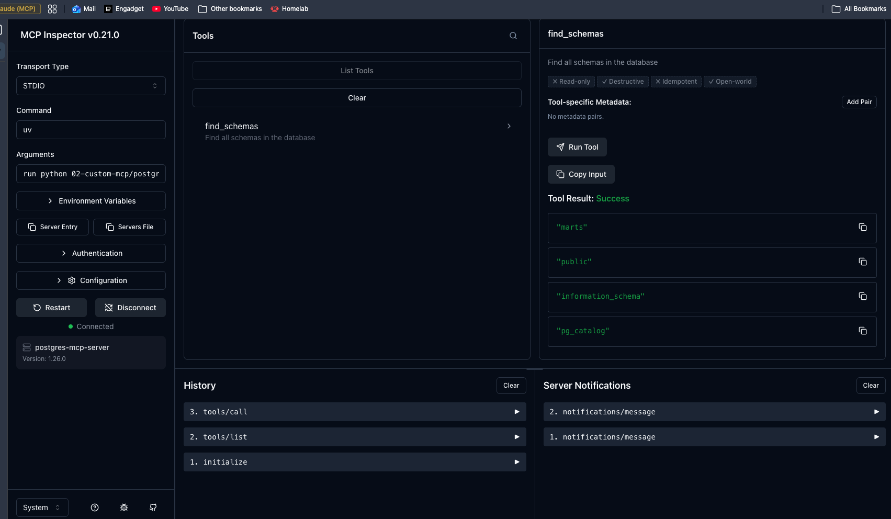
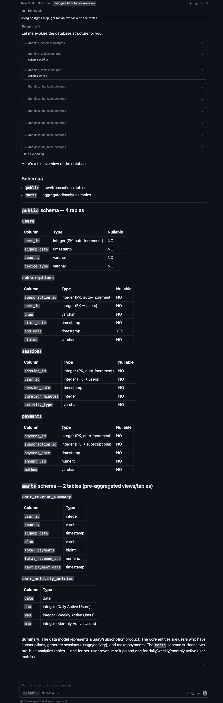
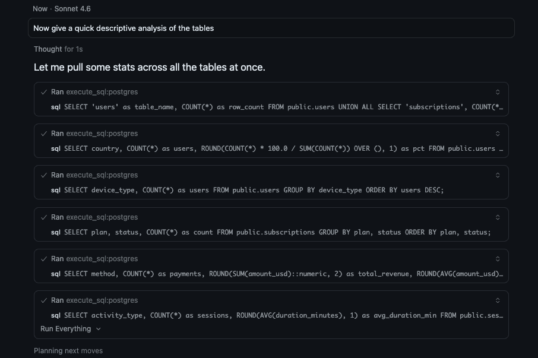

# MCP Server for Postgres

## Simple MCP server for Postgres

**Setup**:
- Python 3.14
- uv

Started with a simple function to get schemas in the database.




I had to put the full path to venv 

```yaml
    "postgres": {
      "command": "/Users/victorguizien/Documents/Projects/random/personal/ai-bootcamp/.venv/bin/python",
      "args": ["/Users/victorguizien/Documents/Projects/random/personal/ai-bootcamp/02-custom-mcp/postgres-mcp-server/main.py"]
    }
```

or this

```yaml
    "postgres": {
      "command": "bash",
      "args": ["-c", "cd /Users/victorguizien/Documents/Projects/random/personal/ai-bootcamp && uv run python 02-custom-mcp/postgres-mcp-server/main.py"]
    }
```


## 3 tools implementation

- find_schemas
- find_tables
- describe_table



## Execute SQL implementaiton



<details>
<summary>Result (Click to expand)</summary>

## Schemas

- **`public`** — raw/transactional tables
- **`marts`** — aggregated/analytics tables

---

## `public` schema — 4 tables

### `users`
| Column | Type | Nullable |
|---|---|---|
| `user_id` | integer (PK, auto-increment) | NO |
| `signup_date` | timestamp | NO |
| `country` | varchar | NO |
| `device_type` | varchar | NO |

### `subscriptions`
| Column | Type | Nullable |
|---|---|---|
| `subscription_id` | integer (PK, auto-increment) | NO |
| `user_id` | integer (FK → users) | NO |
| `plan` | varchar | NO |
| `start_date` | timestamp | NO |
| `end_date` | timestamp | YES |
| `status` | varchar | NO |

### `sessions`
| Column | Type | Nullable |
|---|---|---|
| `session_id` | integer (PK, auto-increment) | NO |
| `user_id` | integer (FK → users) | NO |
| `session_date` | timestamp | NO |
| `duration_minutes` | integer | NO |
| `activity_type` | varchar | NO |

### `payments`
| Column | Type | Nullable |
|---|---|---|
| `payment_id` | integer (PK, auto-increment) | NO |
| `subscription_id` | integer (FK → subscriptions) | NO |
| `payment_date` | timestamp | NO |
| `amount_usd` | numeric | NO |
| `method` | varchar | NO |

---

## `marts` schema — 2 tables (pre-aggregated views/tables)

### `user_revenue_summary`
| Column | Type |
|---|---|
| `user_id` | integer |
| `country` | varchar |
| `signup_date` | timestamp |
| `plan` | varchar |
| `total_payments` | bigint |
| `total_revenue_usd` | numeric |
| `last_payment_date` | timestamp |

### `user_activity_metrics`
| Column | Type |
|---|---|
| `date` | date |
| `dau` | integer (Daily Active Users) |
| `wau` | integer (Weekly Active Users) |
| `mau` | integer (Monthly Active Users) |

---

**Summary:** The data model represents a SaaS/subscription product. The core entities are users who have subscriptions, generate sessions (usage/activity), and make payments. The `marts` schema surfaces two pre-built analytics tables — one for per-user revenue rollups and one for daily/weekly/monthly active user metrics.

---

</details>