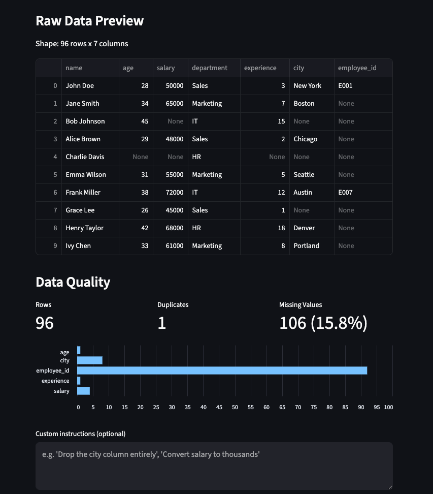
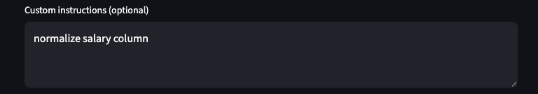
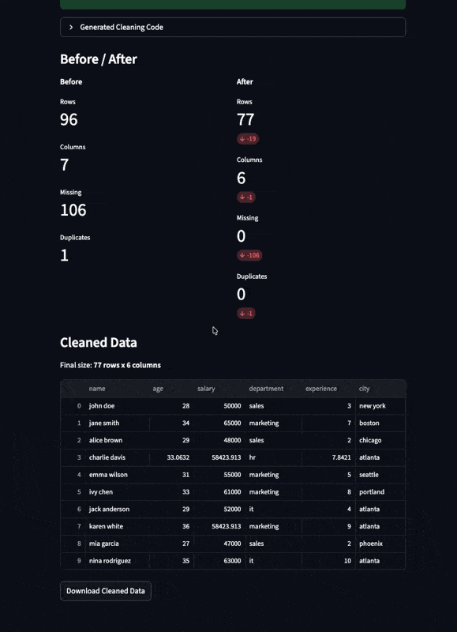
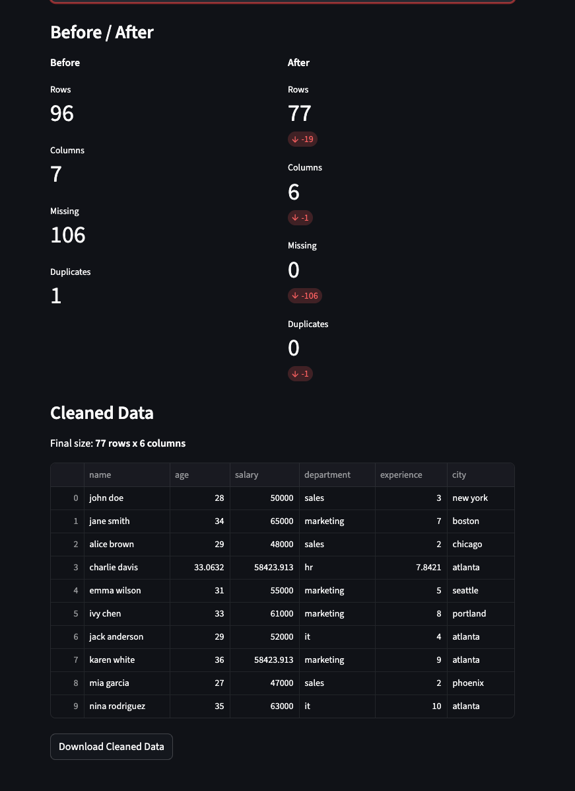

# Data Cleaning Agent

## Setup
```bash
- python 3.14
```

> Note: I had to change the following since the new langchain version changed the import path.

```python
       8 -from langchain.prompts import PromptTemplate                   
       8 +from langchain_core.prompts import PromptTemplate    
```

## Understanding the code
As I didn't really understand the code, I decided to create a simple notebook that goes step by step through the code.

See `test.ipynb` for more details.

## Improvements to data agent

1. Add outlier summary in the dataframe summary function

Comments:
    - In the prompt, using 
       -  "4. Remove outliers (numerical cols) outside of p05 and p95" 
    Will of course create a function where those percentiles are calcualted. But then it got me thinknig, why do we even bother passing the dataframe summary to the agent?

   - I then tried:
     - "4. Remove outliers (numerical cols) outside of anomalous range"
    And unsurprisingly, the function wrote had


```python
    # Step 4: Remove outliers (numerical cols) outside of anomalous range
    outlier_bounds = {
        'age': (3.05, 64.25),
        'salary': (7375.00, 109175.00),
        'experience': (-18.70, 35.70)
    }

    for col, (lower, upper) in outlier_bounds.items():
        if col in data_cleaned.columns:
            data_cleaned = data_cleaned[(data_cleaned[col] >= lower) & (data_cleaned[col] <= upper)]
```

    Using the same values that are given in the prompt 

```
    Outlier Stats (numerical cols):
      age: Lower Bound: 3.05, Upper Bound: 64.25
      salary: Lower Bound: 7375.00, Upper Bound: 109175.00
      experience: Lower Bound: -18.70, Upper Bound: 35.70
```


2. String normalization + dtype correction
   - Added in the prompt via:
     - `5. Normalize string columns (strip whitespace, normalize casing)`
   - Added some examples in dataframe summary function
```python
    # Sample unique values for string columns
    string_cols = df.select_dtypes(include="object").columns
    string_samples = {}
    for col in string_cols:
        unique_vals = df[col].dropna().unique()[:10]
        string_samples[col] = f"{list(unique_vals)}"
    string_summary = "\n  ".join([f"{col}: {val}" for col, val in string_samples.items()])
```

## Improvements to streamlit app

1. Add raw data preview
2. Add data quality metrics
3. Add custom instructions
4. Add generated code visibility with a togle
5. Add a before and after comparison
6. Error handling when agent fails

### Before cleaning


### Adding a custom instruction


### Result (gif)



### Result (png)


## Docker

```bash
cd 03-data-cleaning-agent-2
docker build -t data-cleaning-agent .
docker run -p 8502:8502 --env-file .env data-cleaning-agent
```

Then open http://localhost:8502 in your browser.

## Deploy to Render

1. Push this project to a GitHub/GitLab repo
2. Go to [Render Dashboard](https://dashboard.render.com/) and click **New > Web Service**
3. Connect your repo and select the `03-data-cleaning-agent-2` directory as the root
4. Render will auto-detect the `Dockerfile`
5. Add the `OPENAI_API_KEY` environment variable under **Environment > Environment Variables**
6. Deploy

Alternatively, use the included `render.yaml` blueprint: click **New > Blueprint** and point to the repo.