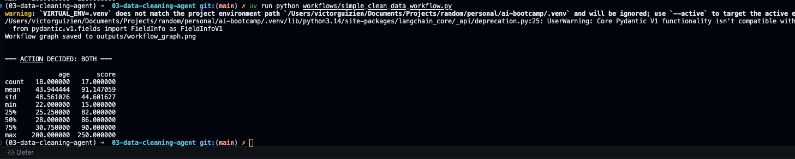

# LangGraph Workflow Example

Used uv and python 3.14

To use both I simply added 

```python
def handle_missing_values_and_remove_outliers(state: DataState) -> DataState:
    """Fill missing values then remove outliers."""
    state = handle_missing_values(state)
    state = remove_outliers(state)
    return state
```


Update route action

```python
def route_action(state: DataState) -> str:
    """Route based on LLM's chosen action."""
    mapping = {
        "clean_missing": "handle_missing_values",
        "remove_outliers": "remove_outliers",
        "handle_missing_values_and_remove_outliers": "handle_missing_values_and_remove_outliers",
        "none": "describe_data",
    }
    return mapping.get(state["action"], "describe_data")
```

Conditional edges

```python
workflow.add_conditional_edges("reasoning_node", route_action, {
    "handle_missing_values": "handle_missing_values",
    "remove_outliers": "remove_outliers",
    "handle_missing_values_and_remove_outliers": "handle_missing_values_and_remove_outliers",
    "describe_data": "describe_data",
})
```

## Result

