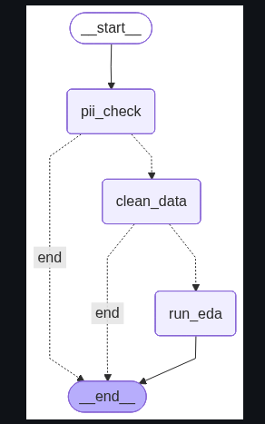
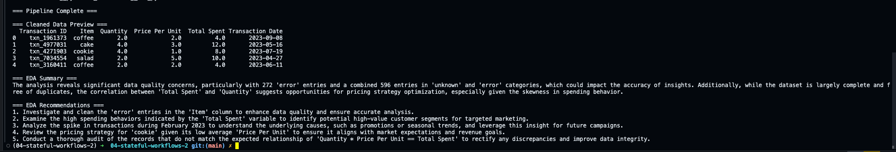

# Stateful Workflows — Data Analyst Agent

## Overview

An orchestration pipeline that chains two LangGraph sub-graphs into a single end-to-end workflow:

1. **PII Guardrail** — scans column names for sensitive data (SSN, email, etc.) and blocks the pipeline if found
2. **Data Cleaning Agent** — LLM-driven cleaning (handles missing values, types, outliers)
3. **EDA Workflow** — automated exploratory data analysis with summary and recommendations

Flow: **raw CSV → PII check → clean data → EDA report**

## What was implemented

- `run_eda_node` — invokes the EDA sub-graph with the cleaned data
- `route_after_cleaning` — routing logic that skips EDA when cleaning fails
- Graph assembly — wiring all nodes and conditional edges together

## Setup

```bash
# Python 3.13 / uv
uv sync
```

Create a `.env` file with your OpenAI API key:

```bash
OPENAI_API_KEY=sk-your-key-here
```

## Run

```bash
uv run python example_usage.py
```

## Results

### Graph structure



### Pipeline output

Cleaned data preview, EDA summary, and actionable recommendations:



## Project structure

```
04-stateful-workflows-2/
├── data/
│   └── cafe_sales.csv
├── data_analyst_agent/
│   ├── __init__.py
│   ├── guardrails.py          # PII column detection
│   ├── orchestrator.py        # Completed orchestration graph
│   └── orchestrator_reference.py
├── assets/images/
├── example_usage.py
├── graph.png
├── pyproject.toml
└── README.md
```

## Notes

- Both sub-projects (`data-cleaning-agent` and `eda-workflow`) live in sibling directories and are added to `sys.path` at runtime.
- The PII guardrail runs before any LLM call — if sensitive columns are detected, the pipeline stops immediately.
- If cleaning fails (error or no cleaned data produced), EDA is skipped via conditional routing.
