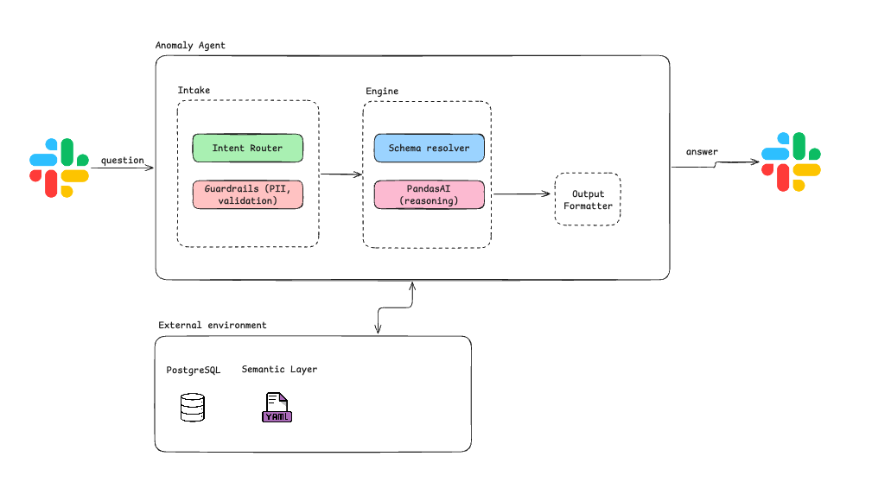

# System Design — Talk-to-Your-Data Slackbot

## Overview

Architecture for a Slackbot that lets team members ask questions about internal data in plain English and get answers back — no SQL needed.

## Architecture

The system is split into three groups inside the agent, plus external data sources:

### Intake

- **Intent Router** — figures out if the message is a data question, a help request, or just chitchat. Non-data messages get a direct response, no LLM call wasted.
- **Guardrails** — PII check, query validation, rate limiting. Runs before any code gets generated.

### Engine

- **Schema Resolver** — maps the question to the right table. Uses the semantic layer (column descriptions etc.) to pick the best data source. Pre-filters with SQL to keep DataFrames small.
- **PandasAI** — takes a DataFrame + semantic context, translates the question into pandas code, runs it, returns a result.

### Output

- **Response Formatter** — tables become code blocks, charts get uploaded as images, numbers become sentences. Errors become friendly messages with a suggestion to rephrase.

### External

- **PostgreSQL** — `users`, `subscriptions`, `payments`, `sessions`
- **Semantic Layer** — PandasAI dataset configs with column descriptions. Found in week 5 that these make a big difference in answer quality.

## Why these components

- Router first because not every message needs an LLM call. Greetings and help requests can be handled instantly.
- Guardrails before PandasAI because it generates and executes code — need to block PII requests and weird queries before anything runs.
- Schema resolver because PandasAI works best with a single DataFrame. Someone needs to figure out which table to load and keep the data small.
- Semantic layer because without column descriptions PandasAI guesses wrong on ambiguous names. Cheap to set up, big improvement.
- Thread-based replies to keep the Slack channel clean.

## Risks

1. **PandasAI accuracy on complex queries** — simple aggregations work great, multi-step analytical questions are hit or miss. The user can't tell if the generated code is wrong. Could mitigate with a "show work" option or confidence disclaimer.

2. **Data size** — PandasAI loads everything into memory. Millions of rows will break it. The schema resolver needs to pre-filter aggressively with SQL (LIMIT, date ranges).

3. **Ambiguous questions** — users will ask "how are we doing?" or ask about data we don't have. The bot needs to say "I don't have that data" instead of hallucinating. The schema resolver should check if any table matches before running anything.
